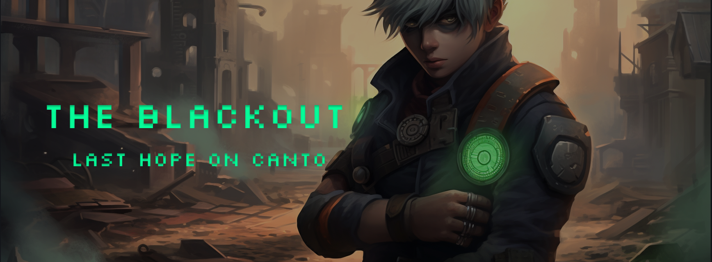

# The Blackout: Last Hope on Canto

[Game - Home](http://64.226.99.135/#/home)
[Test User 1](http://64.226.99.135/#/lobby?userId=3)
[Test User 2](http://64.226.99.135/#/lobby?userId=8)

## Overview

### Mission

Our mission is to revolutionize the online card gaming experience by seamlessly integrating the power of blockchain technology, NFTs, and competitive multiplayer dynamics. We are dedicated to fostering an engaging and inclusive gaming community where players can collect, trade, and strategize with unique, minted card packs on the Canto Blockchain. By empowering our players with true ownership, we aim to nurture creativity, promote fair competition, and reward skillful gameplay through a dynamic leaderboard system. In our pursuit of innovation and excellence, we strive to redefine the boundaries of digital card gaming and build a platform that will stand the test of time.

### One-Liner

Embark on "The Blackout: Last Hope on Canto," the revolutionary blockchain-powered card game that unleashes skill, creativity, and true ownership in a captivating multiplayer universe.

## Repositories

- Organization: [https://github.com/the-blackout0](https://github.com/the-blackout0)
- Game client: [https://github.com/the-blackout0/canto_cards_game](https://github.com/the-blackout0/canto_cards_game)
- dApp Front-end: [https://github.com/the-blackout0/client](https://github.com/the-blackout0/client)
- dApp Back-end: [https://github.com/the-blackout0/backend](https://github.com/the-blackout0/backend)
- Smart Contracts: [https://github.com/the-blackout0/contracts](https://github.com/the-blackout0/contracts)

## NFTs

The game is powered by 4 AI generated NFT collections:

- Avatars - your identity, on The Blackout, Canto & the internet.
- Badges - honorary rewards for your effort. 
- Cards - the backbone of The Blackout. Usable in-game, tradable & more.
- Packs - the way to get your hands on Cards. Packs have different rarities, based on which they drop items upon opening.

All NFTs are minted on the Canto Blockchain and are freely tradeable, allowing for the creation of an entire economy around The Blackout.

To easily get started, you can log into our client platform and mint a free package consisting of 1x Avatar, 5x Cards, and 1x Regular Pack.

After logging in and claiming your free NFTs, you can click the "Go to Game" button on the lower right side of the screen and be redirected into the lobby.

### Lobby and Matchmaking

Upon entering the lobby, players have the option to create a new game or join an existing one. After creating a game, the host will reside in the game lobby, awaiting another player to join. The match commences once both players are in the lobby and the host initiates the game.

### Arena Layout

The arena positions the current player at the bottom of the screen, while the opponent occupies the top. Each player is represented by an avatar, a display name (which can be a truncated wallet address), and three icons indicating Moves, Health, and Attack.

### Decks and Soldier Cards

Players assemble their decks from cards minted on the Canto blockchain through the dApp. Soldier cards come in various types, such as hackers, fighters, engineers, medics, and other specialist roles or equipment. Unique abilities and stats of each soldier card influence gameplay.

### Gameplay and Rounds

During a round, players can play cards up to the number of available moves (currently limited to 1 round and 1 move). Once a card is played, the player cannot play additional cards. After both players have played their cards and clicked the "Ready" button, the opponent's cards are revealed, and the match begins. The winning card is determined and showcased at the center of the screen for a brief moment.

## Contracts
Currently, the smart contracts are deployed on the Canto Testnet and are still in the testing phase.

##### Packs contract: [Link](https://github.com/the-blackout0/contracts/blob/main/contracts/Packs.sol)
- Receives ERC20, mints PACK ERC721
##### Avatars contract: [Link](https://github.com/the-blackout0/contracts/blob/main/contracts/Avatars.sol)
- ERC721 mintable for free, once per address
##### Cards contract: [Link](https://github.com/the-blackout0/contracts/blob/main/contracts/Cards.sol)
- Receives PACK ERC721, mints multiple CARD ERC721 based on rarity

## The Future

- Fix several bugs and refactor the code
- Continue implementing the game mechanics:
  - Card attack/defense/health
  - Player attack/defense/health
  - Card special abilities
  - Several cards/round
  - Several rounds/game
  - More cards

- Implementing Oracles, possibly via RedStone
    - On-chain XP
    - DB Data 
- Easier onboarding
    - Referrals
- Complete client integration
    - Game History
    - NFT Trading
    - Social
    - Level progress & achievements
